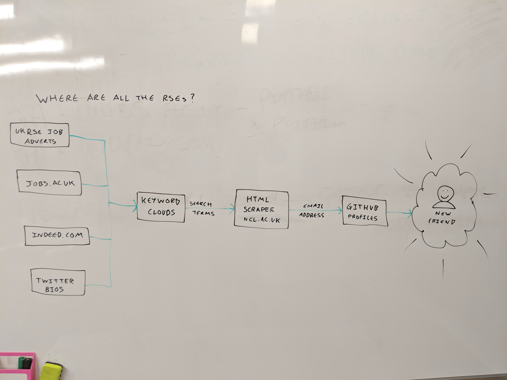

### Finding Research Software Engineers and Research Data Scientists

This project aims to identify Research Software Engineers and Research Data Scientists (some of whom are not formally called like that).

We explore several data sources:

[Research Software Association WordPress Website](http://rse.ac.uk/)

[Indeed.com](http://indeed.com) search for Research+Software+Engineer

[http://www.jobs.ac.uk/](http://www.jobs.ac.uk/) search for Research + Software

[University of Cambridge Website](http://www.cam.ac.uk) search for Big Data

Plos Articles author contribution attribution.

## Architecture

## Analyses

* [Relative term frequency in twitter and RSE job adverts](RSEDescriptionAnalysis.nb.html)
* [Github analysis](https://github.com/mawds/FindRSEs/blob/master/find-github-users.ipynb)
